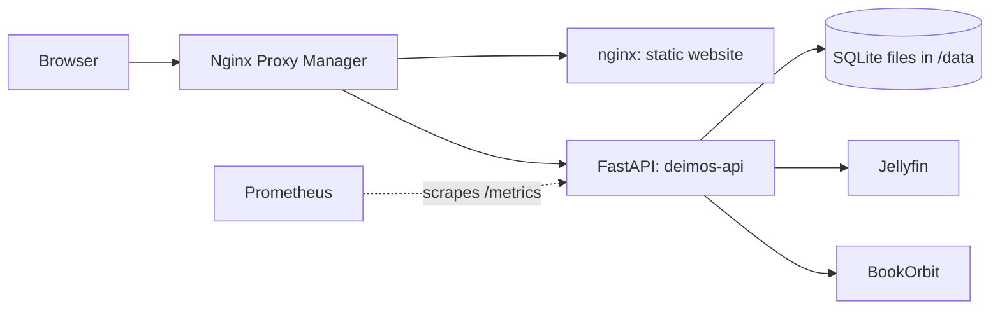

<div align="left">


[](https://github.com/docfrench/deimos_api/actions/workflows/ci.yml)

</div>

## Deimos API

FastAPI backend for my personal homelab website: media-library stats, a playable interactive-fiction catalog, a zero-login AI-vs-human fiction game, and live data for a tabletop RPG campaign site.

### Features:

| Module | What it does | Route prefix |
|---|---|---|
| Media stats | Aggregates library counts from Jellyfin and BookOrbit | `/api/jellyfin`, `/api/bookorbit` |
| Interactive fiction | Catalog of playable IF games (the Zork kind), with author info | `/api/ifdb` |
| AI-vs-human quiz | Zero-login game: guess whether a story was written by an AI or a human | `/api/weighheart` |
| Campaign | Live data for a tabletop RPG campaign website | `/api/vampire` |
 
All persistent data lives in SQLite databases.


### Architecture




### Tech stack

- FastAPI provides the backend wiring
- SQLite as a light, serverless database to persist data
- Docker provides containerization
- Ruff (lint) and pytest (tests)
- Prometheus metrics via `prometheus-fastapi-instrumentator`
- Deployment through GitHub Actions CI/CD (see below)


### CI/CD
 
1. Every push and pull request to `main` runs Ruff and pytest.
2. On `main`, the image is built and pushed to GHCR, tagged with the commit SHA and `latest`.
3. A self-hosted GitHub runner on my server pulls that exact SHA, replaces the running container, checks `/health`, and rolls back to the previous image if the check fails.
Build and deploy jobs run only for pushes to `main`, so pull requests never reach the self-hosted runner. Additionally, pull requests are limited to collaborators only.


### Other related networking
 
- The website itself is hosted on an nginx container
- nginx Proxy Manager (NPM) provides a reverse proxy for internal routing to different Docker containers
- Resilience to dynamic DNS provided by: [cloudflare-ddns](https://github.com/timothymiller/cloudflare-ddns)


### Quick start
 
(This framework is rather personalized to my specific needs, but feel free to try it out)
 
1. Create `.env` using `.env.example` as a template (see [Configuration](#configuration)).
2. Create a `data/` directory containing your SQLite databases (see [Data](#data)).
3. Save this as `docker-compose.yml` and run `docker compose up -d`:
```yaml
services:
  api:
    image: ghcr.io/docfrench/deimos-api:latest
    ports:
      - "8000:8000"
    env_file:
      - .env
    volumes:
      - ./data:/data
    restart: unless-stopped
```
 
4. Check that it's up: `curl http://localhost:8000/health` should return `{"status":"ok"}`.
The image is also available directly: `docker pull ghcr.io/docfrench/deimos-api:latest`.
 
### Configuration
 
All variables are required. The app refuses to start if any are missing.
 
| Variable | Description |
|---|---|
| `JELLYFIN_URL` | Base URL of your Jellyfin server, e.g. `http://192.168.1.10:8096` (no trailing slash) |
| `JELLYFIN_API_KEY` | Jellyfin API key |
| `BOOKORBIT_URL` | Base URL of your BookOrbit server (no trailing slash) |
| `BOOKORBIT_USERNAME` | BookOrbit login |
| `BOOKORBIT_PASSWORD` | BookOrbit password |
 

 
### Data
 
The API expects three SQLite databases in `/data` (mount a volume there):
 
| Module | Database file |
|---|---|
| `ifdb` | `ifdb.sqlite` |
| `vampire` | `vampire_england_db.sqlite` |
| `weigh_heart` | `aiquiz_db.sqlite` |
 
The quiz writes guesses and player names, so that volume must be writable. Schemas and sample data aren't published in this repo yet, so the database-backed routes need your own databases.
 

 
### Development
 
```bash
git clone https://github.com/docfrench/deimos_api.git
cd deimos_api
python -m venv .venv && source .venv/bin/activate
pip install -r requirements.txt
cp .env.example .env        # then fill in your details
uvicorn main:app --reload
```
 
- Tests: `python -m pytest` (the tests import the app, so the variables above must be set; a `.env` works)
- Lint: `pip install ruff && ruff check .`
- Database paths are currently fixed under `/data`, so create that directory for local runs, or run through Docker with a volume.


### API reference
 
Interactive docs are disabled, so this table is the reference.
 
| Method | Path | Description |
|---|---|---|
| GET | `/health` | Liveness check |
| GET | `/metrics` | Prometheus metrics |
| GET | `/api/jellyfin/status` | Item counts per Jellyfin library |
| GET | `/api/bookorbit/books` | Book counts per BookOrbit library |
| GET | `/api/ifdb/entries` | IF catalog; optional `author` and `system` filters |
| GET | `/api/ifdb/authors/{name}` | Author details |
| GET | `/api/weighheart/story/random` | Next unseen story for the session |
| POST | `/api/weighheart/guess` | Submit a guess (AI or human) |
| GET | `/api/weighheart/stats` | Site-wide accuracy stats |
| GET | `/api/weighheart/player/me` | The current player's stats |
| POST | `/api/weighheart/player/name` | Set a display name |
| GET | `/api/weighheart/stats/leaderboard` | Leaderboard (`min_guesses` filter) |
| GET | `/api/vampire/scoreboard` | Active characters: XP, boons, achievements |
| GET | `/api/vampire/players/{name}` | Full details for a player's characters |
| GET | `/api/vampire/sessionlog` | Session summaries |
| GET | `/api/vampire/denizens` | NPCs the party has met |
| GET | `/api/vampire/clocks` | Active campaign clocks |
 

